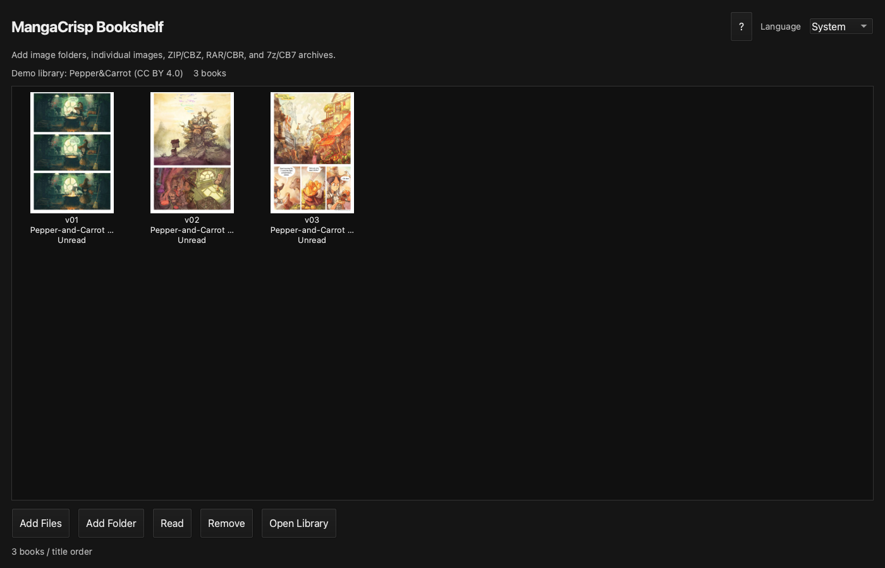
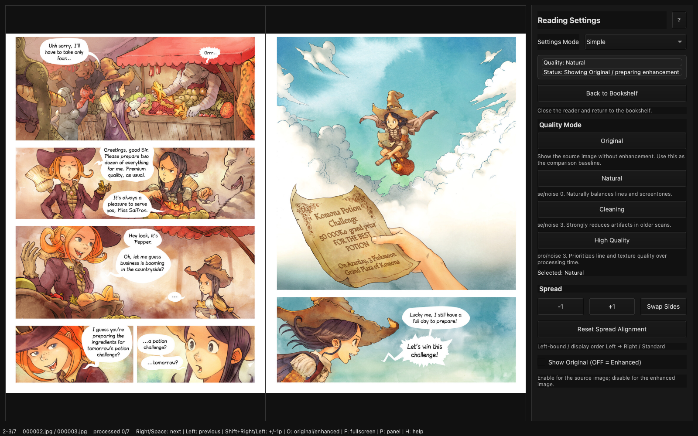

# MangaCrisp

[English](README.md) | [日本語](README.ja.md)

<p align="center">
  
</p>





スクリーンショットと`demo`の画像はDavid Revoy氏の*Pepper&Carrot*を
[CC BY 4.0](demo/ATTRIBUTION.md)に基づいて使用しています。商業漫画の画像は含みません。

MangaCrispは、macOS／Windows向けの無料・オープンソース漫画／コミックビューアです。PDF、CBZ、CBR、ZIP、RAR、7z、画像フォルダを読み込み、本棚、右綴じ見開き表示、Real-CUGANによるAI補正を利用できます。

旧称RAIV for macとして[nalltama/RAIV](https://github.com/nalltama/RAIV)に着想を得て独立実装しました。現在はMangaCrispとして独自の製品方針で開発しており、本家RAIVの公式リリースではありません。

## すぐに使う

一般ユーザーにPython、uv、ターミナル操作は不要です。

### [MangaCrisp v0.7.1-beta Apple Silicon版をダウンロード](https://github.com/jydie5/MangaCrisp/releases/download/v0.7.1-beta/MangaCrisp-v0.7.1-beta-macos-apple-silicon-standalone.zip)

1. 上のリンクからstandalone ZIPをダウンロードします。
2. ZIPをダブルクリックして展開します。
3. `MangaCrisp.app`を`アプリケーション`フォルダへ移動します。
4. 初回だけ`MangaCrisp.app`をControlキーを押しながらクリックし、`開く`を選びます。

詳しい画面説明と起動できない場合の対処は[INSTALL.ja.md](INSTALL.ja.md)にあります。
過去版とSHA-256チェックサムは
[Releasesページ](https://github.com/jydie5/MangaCrisp/releases)で確認できます。

> 現在のβ版は署名・Apple notarization未実施です。初回の通常ダブルクリックはmacOSに止められることがあります。

### Windows開発プレビュー

**[Windows 10/11 x64 Development Previewをダウンロード](https://github.com/jydie5/MangaCrisp/releases/download/windows-preview-0.7.1b0.4/MangaCrisp-0.7.1b0-windows-x64-portable-preview.zip)**

未署名のポータブルZIPで、Python、uv、CUDA、インストーラーは不要です。
監査済みのZig版Real-CUGANを同梱し、NVIDIA GPUで操作と補正を確認しています。
0.7.1ではWindowsの手動連番キャプチャとグローバル撮影／取消キー、単ページ表示を追加しました。
Intel／AMD GPUの補正証跡と、別のクリーンなWindowsアカウントでの検証は
正式Windows版までの残項目です。補正できない場合も原画で閲覧できます。
導入方法と制限は[INSTALL.windows.ja.md](INSTALL.windows.ja.md)を参照してください。

## 最初の一冊を読む

1. MangaCrispを起動すると本棚が開きます。
2. PDF、ZIP、CBZ、RAR、CBR、7z、CB7、または画像フォルダを本棚へドラッグ＆ドロップします。
3. 確認画面で`登録`を選びます。
4. 表紙をダブルクリックすると読書画面が開きます。
5. 左カーソルキーまたはSpaceで先へ進みます。

元の圧縮ファイルは削除しません。本棚には読書用に展開したコピーを保存します。

## v0.7.1-betaの新機能

- **macOS／Windows連番スクリーンキャプチャ:** 許可された画面範囲を手動操作でカラーPNGへ
  連番保存し、確認後にCBZ／ZIPへ完成できます。
- **単ページ表示:** 1画像を画面中央へ最大表示し、1画像ずつ送ります。見開きを
  1枚として撮影した本を、そのまま重複なく読むための表示です。
- **安全な完成処理:** PNGは撮影ごとに即時保存し、保存待ちを完了してから
  アーカイブ化します。同じページ構成を誤って複数回完成することも防ぎます。

初回撮影前に[連番スクリーンキャプチャ](#連番スクリーンキャプチャベータ)を確認してください。
macOSでは[画面収録の許可手順](INSTALL.ja.md#キャプチャ用の画面収録を許可する)も必要です。

## AI補正と原画比較

正式macOS standalone版には、公式の`realcugan-ncnn-vulkan 20220728 macOS`
実行ファイルとモデルを同梱しています。Windows Development Previewには、
固定・監査済みのZig版Windowsエンジンと同じモデルを同梱しています。
どちらも追加セットアップは不要です。

- 読書中は現在の見開きと前後のページをバックグラウンドで自動補正します。
- 読む速さに応じて前方12〜24ページ、後方4ページを循環保持します。
- `P`キーで読書設定を開きます。
- `原画を表示（OFFで補正版）`をONにすると原画、OFFにすると補正版です。
- `状態: 補正済み`になる前は、切り替えても同じ原画が表示される場合があります。
- 縦2234px以上の画像は標準設定では補正を省略します。

macOS版の補正処理はApple Silicon GPUをVulkan/Metal経由で使用します。
Windows版はVulkan対応GPUを使用します。補正を待っている間も原画で読み進められます。

## 画質モード

通常は`かんたん`モードで次の4種類から選びます。

| モード | 用途 |
|---|---|
| 原画 | 補正せず元画像を表示 |
| 自然 | 線とトーンを自然に整える標準設定 |
| クリーニング | 古いスキャンや圧縮荒れを強めに抑える |
| 高画質 | 処理時間より仕上がりを優先 |

`マニュアル`へ切り替えると、モデル、倍率、noise、tile、TTA、補正スキップ解像度を変更できます。調整した組み合わせには名前を付けて保存し、次回起動後も呼び出せます。

## 主な機能

- 表紙を並べる本棚
- 複数アーカイブのドラッグ＆ドロップ登録
- macOS／Windowsの固定範囲をカラーPNGとCBZ／ZIPへ保存する連番キャプチャ
- PDF、ZIP/CBZ、RAR/CBR、7z/CB7、画像フォルダ
- 全ページ変換を行わず、必要なページだけカラー保持で描画するPDF対応
- 上限付きPDF描画／AI補正キャッシュとキャッシュ削除操作
- 不具合報告に使える個人情報を含まない診断情報のコピー
- 右綴じ漫画の表紙単独・見開き表示
- 見開き撮影画像を1枚ずつ中央表示する単ページ表示
- 巻順の並び替えと次巻への移動
- 読書位置の保存
- 全画面表示と透過進捗オーバーレイ
- Real-CUGANの自動先読み補正
- 読書速度に応じた適応先読み
- 非同期画像デコードと原画フォールバックによる即時ページ送り
- かんたん／マニュアル画質設定とカスタム設定保存
- 原画と補正版の即時切り替え
- 本棚からの削除と保存先表示
- OS言語に追従する英語／日本語UI

開発中の機能、既知の改善項目、実装順は[ROADMAP.md](ROADMAP.md)で確認できます。

## 表示言語

初期状態ではmacOS／Windowsの優先言語に従います。本棚右上の`言語`から`システム設定`、
`英語`、`日本語`を選択できます。変更後にMangaCrispを再起動すると、本棚、ビューワ、
確認画面、ヘルプ、状態表示が同じ言語へ切り替わります。

## キーボード操作

右綴じ漫画の標準設定です。

| キー | 動作 |
|---|---|
| `←` / `Space` | 次の見開き |
| `→` | 前の見開き |
| `Shift + ←` | 1ページ先へずらす |
| `Shift + →` | 1ページ前へずらす |
| `V` | 見開き（2画像）／単ページ（1画像）を切り替え |
| `F` | 全画面 |
| `P` | 読書設定の表示／非表示 |
| `O` | 原画／補正版を切り替え |
| `H` / `?` | ショートカット一覧とプロジェクトリンク |
| `Esc` | 全画面解除／本棚へ戻る |

## マウス操作

クリック領域は読書方向に連動し、ウインドウ表示と全画面表示で同じように動作します。

| 操作 | 動作 |
|---|---|
| 進行方向側40%をクリック | 次の見開き |
| 戻る方向側40%をクリック | 前の見開き |
| `Shift` + 左右領域クリック | 1ページ進む／戻す |
| 中央20%をクリック | ページ情報を表示／非表示 |
| 右クリック | 前の見開き |

右綴じ漫画は左側クリックで進み、右側クリックで戻ります。左綴じコミックでは逆になります。
ドラッグ操作ではページを送りません。

画面キャプチャなどで1画像の中に見開きが含まれている場合は、読書設定の
`単ページ（1画像）`を選びます。画像を中央に大きく表示し、通常のページ送りも
1画像ずつ進みます。`V`キーで見開き表示と即時に切り替えられます。

## 連番スクリーンキャプチャ（ベータ）

自分が権利を持つ画面、または保存を許可された画面だけに使用してください。
MangaCrispは自動ページ送りや画面保護の回避を行いません。

1. 本棚の`画面を連番キャプチャ`を開きます。
2. セッション名と保存先を決め、撮影範囲を選びます。
3. `撮影を開始`を押します。macOSの初回だけ`画面収録とシステムオーディオ録音`で
   MangaCrispを許可し、アプリを完全終了して同じアプリを開き直します。
4. 対象アプリでページを手動で送り、画像ごとにmacOSは`Option+C`、Windowsは
   `Alt+C`を1回押します。直前の撮影取消は`Option+Z`または
   `Alt+U`です。Windowsでは他アプリと競合する場合に別プリセットも選べます。
5. Windowsではタスクバーに最小化されたMangaCrispをクリックし、macOSではDockから
   MangaCrispを開いて管理画面を戻し、`撮影を完了`を押します。
   元の連番PNGは完成したCBZ／ZIPと同じセッションフォルダへ残ります。

撮影画像はローカルへ保存し、外部へ送信しません。1回の撮影に見開き全体が
含まれる場合は、完成した本を開いて`V`キーで単ページ表示へ切り替えてください。
権限設定と復旧手順は[INSTALL.ja.md](INSTALL.ja.md)に記載しています。

## 保存場所

- 本棚データ: 新規利用者は`~/MangaCrisp Library`
- AI補正キャッシュ: `~/Library/Caches/MangaCrisp`
- 本棚データベース: `~/Library/Application Support/MangaCrisp`

Windowsの保存場所は[INSTALL.windows.ja.md](INSTALL.windows.ja.md)に記載しています。

元のZIP/RARは取り込み後も元の場所に残ります。本棚から削除するとMangaCrispが作った展開済みコピーと読書状態を削除します。

旧RAIV for macを利用していた場合、初回起動時に設定、データベース、AIキャッシュと
旧既定の`~/RAIV Library`を新名称の保存先へ移行します。本棚フォルダはコピーせず、
同じディスク上で名前を変更するため、本や読書位置を保ったまま短時間で移行できます。
ユーザーが選択したカスタム保存先は変更しません。

## アンインストール

1. `MangaCrisp.app`をゴミ箱へ移動します。
2. 本棚も不要なら設定中の本棚保存先を削除します。
3. 補正キャッシュも不要なら`~/Library/Caches/MangaCrisp`を削除します。

元のZIP/RARはMangaCrispのアンインストールでは削除されません。

## 現在の制限

- 正式macOS版はApple Silicon専用で、Intel Macには対応していません。
- Windows x64版はDevelopment Previewで、Intel／AMD／別アカウントの
  リリース証跡が未完了です。
- 両OS版とも未署名で、macOS版はApple notarizationも未実施です。
- β版のためUIと設定の互換性が変わる可能性があります。
- RAR形式によってはmacOS側の展開機能との相性で開けない場合があります。
- 自動アップデートは未実装です。新しいZIPをReleasesから取得してください。

## ソースコードから起動する

この項目は開発者向けです。一般ユーザーはstandalone版を利用してください。

```bash
git clone https://github.com/jydie5/MangaCrisp.git
cd MangaCrisp
uv sync --extra gui
uv run mangacrisp
```

Python不要のローカルアプリを作る場合:

```bash
uv sync --extra app
uv run --extra app python scripts/build_macos_app.py --bundle-engine
```

ビルド時に公式Real-CUGAN macOS ZIPをGitHub Releasesから取得し、SHA256を検証してから同梱します。ローカルの未知のバイナリは使用しません。

開発用テスト:

```bash
uv sync --extra dev
uv run pytest
```

## 開発を支援する

MangaCrispは支援の有無にかかわらずMIT Licenseの無料ソフトウェアです。
Star、不具合報告、動作テスト、コードへの貢献を歓迎します。MangaCrispが役立った場合は、
[Buy Me a Coffeeで今後の開発を任意で支援](https://buymeacoffee.com/jydie5)
できます。支援はAI・API利用料、テスト、継続開発に活用し、機能の解放や
ソフトウェアのライセンスには影響しません。送金には、このリポジトリ内に掲載した
公式リンクだけを利用してください。

## ライセンス

MangaCrisp本体はMIT Licenseです。同梱するReal-CUGANと依存物の由来、バージョン、ライセンスは[THIRD_PARTY_NOTICES.md](THIRD_PARTY_NOTICES.md)に記載しています。standaloneアプリ内にもライセンス全文を収録します。

## 自由ライセンスのデモ本

[`demo`](demo)には、本棚へそのままドロップできる小さなZIPを3冊収録しています。
David Revoy氏による*Pepper&Carrot*第1〜3話の英語・低解像度版で、各ZIP内にも
作者名、出典、CC BY 4.0の表示を収録しています。
